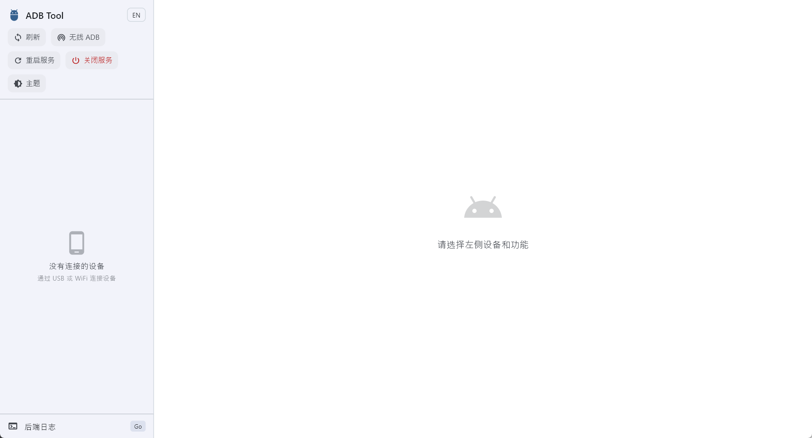
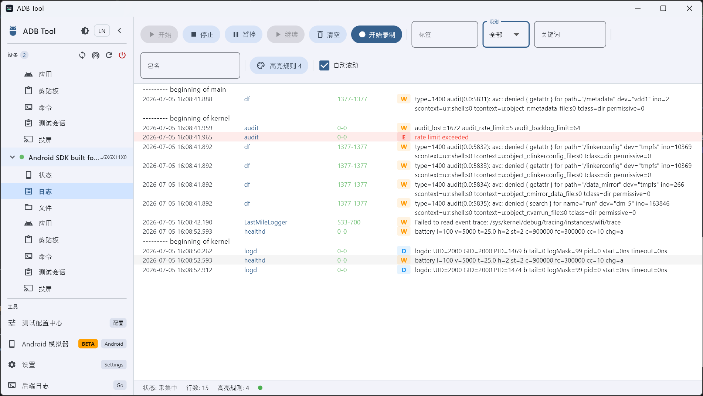
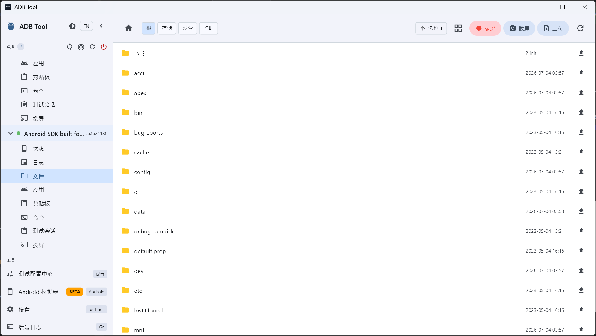
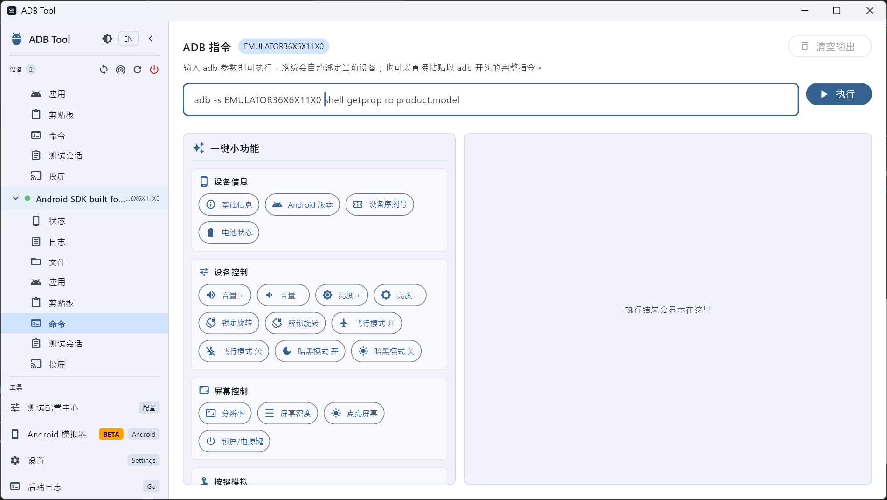
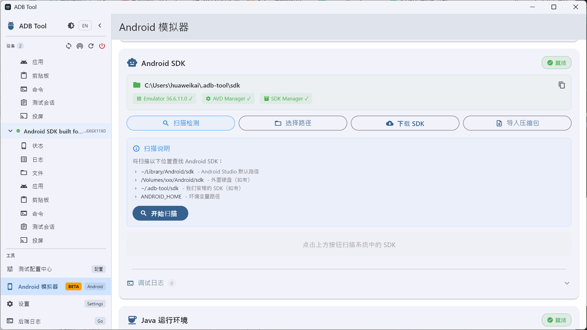
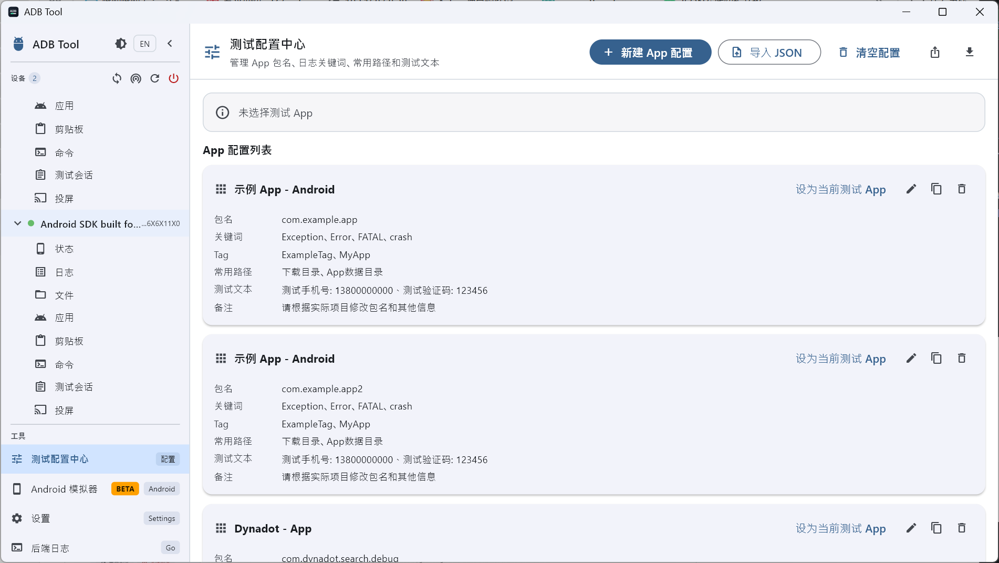
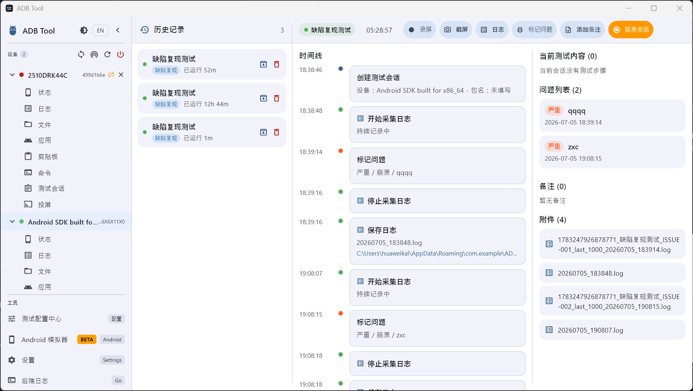
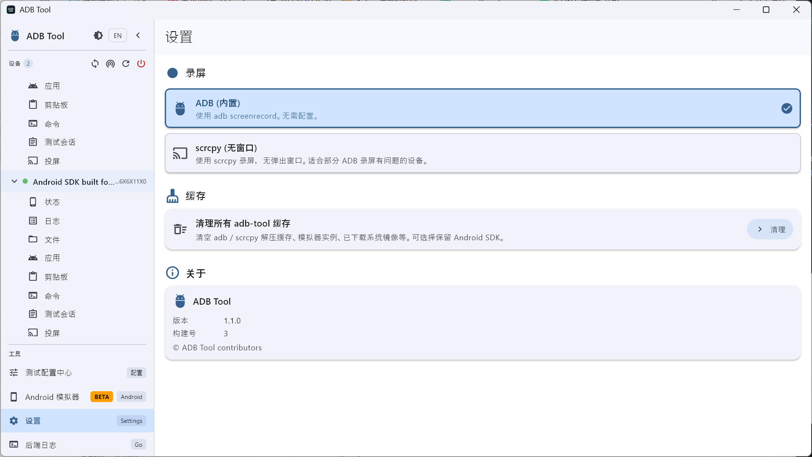

# ADB Tool

[中文文档](README.md)

ADB Tool is a cross-platform desktop utility for Android debugging and testing workflows. It wraps common ADB capabilities into a graphical interface, making it easier to inspect devices, collect logs, manage files, install applications, run debugging commands, mirror device screens, and connect to devices over wireless ADB.

The project is built with a **Flutter desktop frontend, a Go backend, and an Android clipboard helper APK**. Flutter provides the desktop UI, the Go backend starts a local service and encapsulates ADB / scrcpy capabilities, and the Android helper APK enables clipboard-related features on target devices.

## Screenshots

### Device Home



### Real-time Logcat



### File Manager



### ADB Commands



### Android Emulator



### Test Configuration



### Test Session



### Settings



## Features

- **Device management**: Automatically detects Android devices connected via USB or WiFi, and displays model, brand, Android version, and connection state.
- **Screen mirroring**: Mirrors device screens through the bundled scrcpy binary, supports simultaneous mirroring of multiple devices; video displayed in a separate scrcpy window or captured via headless recording, with per-device video, audio, window, control, device, and recording options plus a shortcut reference.
- **Android Emulator**: Built-in Android SDK Emulator support, including downloading system images, creating AVD instances, starting and stopping emulators, and per-device engine path and Java runtime configuration.
- **Logcat viewer**: Streams logs in real time through WebSocket, with filters for level, tag, package name, PID, and keywords. It also supports pause, resume, clear, and auto-scroll.
- **File manager**: Browses the Android file system, uploads and downloads files, deletes, renames, creates files and folders, copies paths, views file details, saves screenshots, and records screen videos.
- **App management**: Lists installed apps, searches package names, installs APK files by drag and drop, uninstalls apps, and provides readable messages for common installation failures.
- **Device information**: Shows device properties, system information, and `getprop`-based details.
- **Clipboard tool**: Sends text from the desktop to an Android device after installing the helper APK, and keeps a reusable history of recently sent snippets.
- **ADB command panel**: Runs ADB arguments or full ADB commands, with quick actions for device information, screen control, key simulation, debugging diagnostics, storage/network checks, and maintenance operations.
- **Wireless ADB**: Supports wireless pairing, connection, and disconnection.
- **Backend logs**: Displays runtime logs generated by the local Go backend when executing ADB operations.
- **Test Config**: Manage tested app profiles, common paths, test texts, deep links, Logcat filters, and reusable test flows/steps, with config copy support for quick adjustments.
- **Test Session**: Create sessions that inherit the selected test config flows/steps, show the current test plan on the right panel, mark steps as passed or failed with notes, and collect timeline, screenshot/video/log attachments, issues, notes, reports, and historical sessions.
- **Settings**: Provides a unified settings page with light/dark theme toggles, Chinese/English UI switching, screen recording storage path and recording mode configuration, and more.
- **Command palette**: Open the command palette with Cmd/Ctrl+K for keyboard shortcut navigation and global actions, improving operational efficiency.

## Architecture

| Layer | Technology | Path | Description |
|---|---|---|---|
| Desktop frontend | Flutter / Dart / Dio / WebSocket | `flutter_app/` | Provides the macOS and Windows desktop GUI |
| Backend | Go / net/http / gorilla/websocket | `backend/` | Starts the local HTTP service, wraps ADB operations, and extracts embedded ADB / scrcpy binaries |
| Android helper | Kotlin / Gradle | `adb_tool_app/` | Clipboard helper APK installed on target Android devices |
| Build scripts | PowerShell / Bash | `scripts/` | Builds backend, frontend, and platform-specific outputs |
| API documentation | Markdown | `api/README.md` | Documents the unified backend response protocol and fields |

Runtime flow:

1. The desktop app starts the local Go backend.
2. The backend extracts or loads the embedded platform-tools ADB binary and the scrcpy components available for the current platform.
3. Flutter calls backend APIs through `http://localhost:9876`.
4. The backend executes ADB commands and returns unified JSON responses.
5. Logcat messages are streamed to the frontend through the `/ws/logs` WebSocket endpoint.
6. Screen mirroring is started and stopped through `/api/scrcpy/*`, while per-device mirror settings are persisted locally.

## Project Structure

```text
.
├── adb_tool_app/            # Android clipboard helper APK project
├── api/                     # Backend API response protocol and field documentation
├── assets/                  # Screenshots used by README files
├── backend/                 # Go backend service, ADB operation wrappers, and bundled scrcpy resources
│   ├── internal/server/     # HTTP routes, WebSocket, and layered ADB (split by concern)
│   └── uninstall/           # Windows MSI uninstaller entry point
├── flutter_app/             # Flutter desktop project
│   ├── lib/
│   │   ├── models/          # Frontend data models (Device / DeviceStatus / FileItem / ScrcpyOptions / ...)
│   │   ├── db/              # Local SQLite persistence (drift: tables/ + dao/)
│   │   ├── providers/       # Global state (device / theme / locale / test_session / test_config / scrcpy_settings)
│   │   ├── services/        # API client, log stream, server launcher, capture, drag/drop
│   │   │   └── api/         # REST clients split by domain (10 files)
│   │   ├── screens/         # Feature screens (test_session split into hub/active/preview)
│   │   ├── widgets/         # Cross-screen reusable widgets
│   │   ├── mixins/          # Screenshot / screen-record capture mixins
│   │   ├── utils/           # Test-flow text parser, time formatters, legacy cleanup
│   │   └── i18n/            # Per-screen Chinese/English dictionaries + i18n.dart entry
│   └── test/                # Unit / widget tests
├── scripts/                 # macOS and Windows build scripts + i18n check
├── docs/                    # Design documents (e.g. OPTIMIZATION_PROPOSAL.md)
└── PROJECT_OVERVIEW.md      # Detailed project architecture document
```

## Requirements

Basic development environment:

- Flutter 3.4+ / Dart 3.4+
- Go 1.26.3+
- Android SDK, required when rebuilding the clipboard helper APK
- macOS or Windows desktop build environment

Additional requirements for building a Windows installer:

- WiX Toolset v5
- Required WiX UI extension

If `ANDROID_HOME` is not configured, the build scripts will reuse the existing `backend/clipboard-helper.apk` when available. If that APK is missing, configure the Android SDK first and rebuild it.

## Development

### Start the backend

```bash
cd backend
go run .
```

The backend listens on:

```text
http://localhost:9876
```

### Start the Flutter desktop app

```bash
cd flutter_app
flutter pub get
flutter run -d macos
```

On Windows:

```powershell
cd flutter_app
flutter pub get
flutter run -d windows
```

## Build

### macOS

```bash
./scripts/build.sh --platform macos --mode release
```

Debug build:

```bash
./scripts/build.sh --platform macos --mode debug
```

### Windows

```powershell
.\scripts\build.ps1 -Mode Release -Platform Windows -GoArch amd64
```

Debug build:

```powershell
.\scripts\build.ps1 -Mode Debug -Platform Windows -GoArch amd64
```

## API Response Protocol

Backend JSON APIs use a unified response envelope:

```json
{
  "ok": true,
  "data": {}
}
```

Failure response:

```json
{
  "ok": false,
  "data": null,
  "error": "serial required"
}
```

Successful binary download endpoints are not wrapped in the JSON envelope, such as screenshots, file downloads, and screen-recording videos. See [api/README.md](api/README.md) for detailed field documentation.

## Usage Notes

- Make sure Developer Options and USB Debugging are enabled on the Android device before connecting it for the first time.
- If the device state is `unauthorized`, confirm the USB debugging authorization prompt on the device.
- Some directories in the file manager may be inaccessible due to Android-side permission restrictions.
- When APK installation fails because of signature conflicts, the backend attempts to handle the case and returns a more readable error message.
- Before running destructive actions from the ADB command panel, such as rebooting, uninstalling, or clearing data, confirm the selected target device and command content.

## More Documentation

- [API response protocol and fields](api/README.md)
- [Project architecture overview](PROJECT_OVERVIEW.md)
